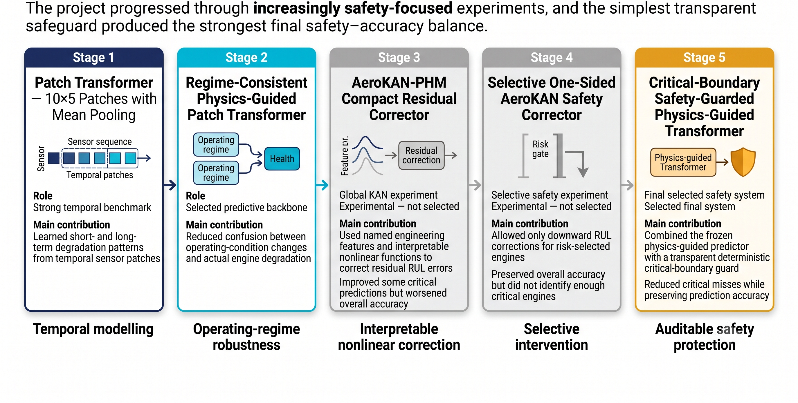
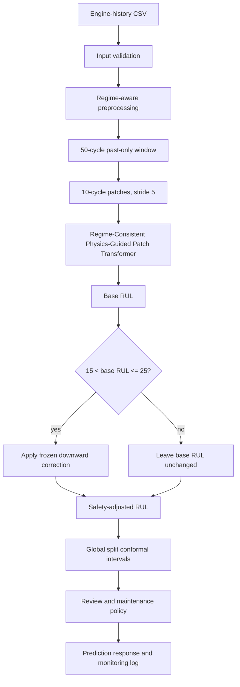

# AeroGuard-PHM

> A production-style turbofan predictive-maintenance system combining physics-guided temporal modelling, calibrated uncertainty and an interpretable safety guard for reliable remaining-useful-life decisions.

**Frozen v1.0.0 release** | **64 model and system candidates evaluated** | **99.02% operational critical recall** | **FastAPI and Streamlit deployment**

<!--
IMAGE NOT RENDERED:
docs/assets/readme/hero/aeroguard_phm_hero.png
Reason: Generated image contains visible typo "Concluse maintenance recommendation".
Regenerate before enabling:
<p align="center">
  
</p>
-->

## Release Snapshot

The complete production system is the **AeroGuard-PHM Safety-Guarded RUL System**. The final selected predictive system is the **Critical-Boundary Safety-Guarded Physics-Guided Transformer**. Its final architecture is the **Critical-Boundary Safety-Guarded Physics-Guided Patch Transformer**, built around the **Regime-Consistent Physics-Guided Patch Transformer** backbone and a deterministic safety guard.

| Metric | Final v1.0.0 value | Source |
| --- | ---: | --- |
| Overall MAE | 14.5632 cycles | [`headline_model_comparison.csv`](reports/final_release/headline_model_comparison.csv) |
| Overall RMSE | 20.9603 cycles | [`headline_model_comparison.csv`](reports/final_release/headline_model_comparison.csv) |
| Severe optimistic rate | 0.0566 | [`point_prediction_comparison.csv`](reports/final_release/point_prediction_comparison.csv) |
| Critical misses | 1 | [`fixed_policy_safety_comparison.csv`](reports/final_release/fixed_policy_safety_comparison.csv) |
| Operational critical recall | 0.9902 | [`fixed_policy_safety_comparison.csv`](reports/final_release/fixed_policy_safety_comparison.csv) |
| Review workload | 0.1924 | [`fixed_policy_safety_comparison.csv`](reports/final_release/fixed_policy_safety_comparison.csv) |
| Model/system candidates evaluated | 64 | [`model_registry.csv`](reports/final_release/model_registry.csv) |

## Quick Navigation

- [What AeroGuard-PHM solves](#what-aeroguard-phm-solves)
- [Why RMSE alone is not enough](#why-rmse-alone-is-not-enough)
- [Dataset: NASA C-MAPSS](#dataset-nasa-c-mapss)
- [End-to-end data pipeline](#end-to-end-data-pipeline)
- [Models evaluated](#models-evaluated)
- [Development journey](#development-journey)
- [Final architecture](#final-architecture)
- [Physics-Guided Patch Transformer](#physics-guided-patch-transformer)
- [Final safety guard](#final-safety-guard)
- [Final results](#final-results)
- [Uncertainty quantification](#uncertainty-quantification)
- [Interactive Streamlit Dashboard](#interactive-streamlit-dashboard)
- [FastAPI inference service](#fastapi-inference-service)
- [Quick start](#quick-start)
- [Production inference output](#production-inference-output)
- [Monitoring](#monitoring)
- [Testing](#testing)
- [Reproducibility and frozen artifacts](#reproducibility-and-frozen-artifacts)
- [Limitations](#limitations)
- [Responsible use](#responsible-use)

## What AeroGuard-PHM Solves

Modern turbofan engines degrade gradually. Their sensors measure temperatures, pressures, fan speeds, core speeds and operating settings, but those sensors do not directly report a clean health percentage. A high temperature can reflect real degradation, a change in operating condition, or both. A single row of data is therefore not enough; the model needs to read a recent sequence and separate operating-regime effects from deterioration.

**Remaining Useful Life**, or **RUL**, is the estimated number of operating cycles left before an engine reaches its defined end-of-life condition.

RUL prediction matters because it sits close to maintenance decisions. A prediction of 90 cycles may simply continue monitoring. A prediction near 15 cycles may trigger urgent engineering review. In that setting, a model needs point accuracy, uncertainty, safe review logic and clear limitations.

> An optimistic prediction tells the operator that more life remains than is actually available. This can delay inspection or maintenance.

AeroGuard-PHM asks a practical research question: can a temporal RUL model stay competitive on point accuracy while reducing the most safety-relevant late predictions?

<!--
IMAGE NOT RENDERED:
docs/assets/readme/hero/rul_problem_statement.png
Reason: Generated image contains visible text errors: "Layout layout" and "future failure prnnt point".
Caption to use after regeneration:
RUL prediction requires separating true degradation from sensor changes caused by operating conditions, then estimating the unknown time to failure from past-only sensor history.
-->

## Why RMSE Alone Is Not Enough

Suppose two engines both have a 20-cycle prediction error:

- Engine A is predicted 20 cycles too early. This can cause earlier inspection or maintenance.
- Engine B is predicted 20 cycles too late. This can delay action when less life remains than expected.

Both errors have the same absolute size, but they do not have the same operational meaning. AeroGuard-PHM therefore reports point accuracy, optimistic error, critical misses, review workload and uncertainty separately.

| Term | Intuitive meaning |
| --- | --- |
| MAE | Average absolute miss in cycles |
| RMSE | Error metric that punishes large misses more strongly |
| NASA score | Asymmetric prognostics score that penalizes late optimistic predictions more than conservative predictions |
| Optimistic error | Predicted RUL is higher than the benchmark remaining life |
| Severe optimistic error | Optimistic error above the 30-cycle severe threshold |
| Critical miss | Engine is actually within the urgent region, but the policy does not flag it urgently |
| Operational critical recall | Share of truly critical engines caught by the operational policy |
| Review workload | Share of engines routed to engineering review |

<details>
<summary>Technical metric definitions</summary>

The final comparison uses aligned benchmark engine keys, uncapped final-cycle RUL labels and this residual orientation:

```text
residual = predicted_rul - true_rul
```

Positive residuals are optimistic. Negative residuals are conservative.

The canonical severe optimistic threshold is 30 cycles. The fixed-policy critical threshold is 15 cycles. The final comparison separates model effects from policy effects by evaluating all headline systems on the same fixed `point_u15_s30_i60` policy where applicable.

</details>

## Dataset: NASA C-MAPSS

AeroGuard-PHM uses the NASA C-MAPSS turbofan degradation benchmark. C-MAPSS is simulated turbofan data, not real airline maintenance telemetry. It contains multivariate time-series records for multiple engines. Each row represents one operating cycle with operating settings and sensor channels.

Training engines are run-to-failure histories. For training, a per-cycle RUL target can be derived because the end-of-life cycle is known. Test engines are truncated histories: the model sees only the current history and must predict the final-cycle RUL. Benchmark RUL labels are attached only after prediction for offline evaluation; they are not deployment inputs.

| Subset | Operating conditions | Fault modes | Main challenge |
| --- | ---: | ---: | --- |
| FD001 | One | One | Basic single-domain degradation |
| FD002 | Multiple | One | Operating-regime variation |
| FD003 | One | Multiple | Multiple degradation mechanisms |
| FD004 | Multiple | Multiple | Strongest multidomain challenge |

FD004 is the hardest subset because operating conditions and degradation modes both vary. A robust system must avoid confusing operating-regime shifts with damage while still recognizing deterioration.

## End-to-End Data Pipeline

The pipeline is designed around leakage prevention. The model may use past sensor history, but not future cycles or benchmark answers.

1. Load FD001-FD004 train and test files.
2. Validate required files and expected columns.
3. Assign collision-safe global engine IDs such as `FD004_0177`.
4. Derive per-cycle training RUL from run-to-failure training histories.
5. Apply the configured RUL cap where appropriate for training.
6. Split train and validation engines by engine identity.
7. Fit preprocessing only on fitting engines.
8. Identify operating regimes from operational settings.
9. Build past-only temporal windows.
10. Construct final-cycle benchmark windows without labels.
11. Attach benchmark labels only after model prediction.


This design keeps benchmark labels out of model inputs and inference examples. It also prevents preprocessing statistics from being fitted on held-out engines.

## Models Evaluated

The frozen release registry contains 64 model and system entries. The main README groups them by family; the full registry is available in [`reports/final_release/model_registry.csv`](reports/final_release/model_registry.csv).

### Classical Baseline

The project includes a classical Random Forest RUL baseline. It is useful as a tabular point of comparison, but it does not model temporal degradation as directly as sequence models.

### Deep Sequence Models

Confirmed deep sequence candidates include Sequence MLP, 1D CNN, LSTM, GRU, TCN and CNN-LSTM variants. These models established whether standard sequence architectures could learn useful degradation patterns from the 50-cycle histories.

### Temporal and Patch Transformer Candidates

Temporal Transformer and Patch Transformer variants tested attention-based sequence modeling. The strongest temporal benchmark was the **Patch Transformer — 10×5 Patches with Mean Pooling**. Patching reduces the number of tokens by grouping adjacent cycles, which helps the model focus on local degradation patterns without attending over every raw cycle independently.

### Physics-Guided Candidates

Physics-guided candidates included a Patch Transformer reimplementation baseline, monotonicity guidance, cycle-rate guidance, smoothness guidance, health-index guidance, regime-consistency guidance, temporally combined guidance, full physics guidance and full physics-and-safety guidance. The selected predictive backbone was the **Regime-Consistent Physics-Guided Patch Transformer**.

### Residual and KAN Candidates

Residual candidates included linear and small-MLP residual correctors, direct additive KAN heads, sparse additive KAN residual correctors, safety-weighted sparse KAN correctors, regime-aware KAN correctors and the **AeroKAN-PHM Compact Residual Corrector**.

KAN stands for Kolmogorov-Arnold Network. Instead of assigning one fixed weight to each input feature, a KAN learns a one-dimensional nonlinear function along each connection. That can be useful for interpretability, but it does not automatically make a model safer or more accurate.

### Safety Refinements

The final safety refinements were the **Selective One-Sided AeroKAN Safety Corrector** and the **Critical-Boundary Safety-Guarded Physics-Guided Transformer**. These systems focused on operational behavior around the urgent maintenance threshold rather than only on global error metrics.

## Development Journey

The project evolved as an engineering story rather than a simple leaderboard. Each stage answered a different question about accuracy, physical plausibility, interpretability or safety.

<p align="center">
  
</p>

<p align="center"><em>AeroGuard-PHM progressed from temporal modelling to physics guidance, interpretable correction experiments and a final auditable safety safeguard.</em></p>

### Patch Transformer — 10×5 Patches with Mean Pooling

The Patch Transformer became the strong temporal benchmark. It uses a 50-cycle past-only history and converts it into overlapping 10-cycle patches with stride 5. This gives the model local temporal summaries while keeping the attention sequence compact.

Its headline performance was:

- MAE: 14.9550 cycles
- RMSE: 21.2671 cycles
- Severe optimistic rate: 0.0651
- Critical misses: 26
- Operational critical recall: 0.7451

This was a strong starting point because it modeled degradation as a sequence rather than as one final tabular snapshot.

### Regime-Consistent Physics-Guided Patch Transformer

Operating regimes can confuse degradation learning. Two engines may have similar health but different sensor values because they are running under different conditions. Regime-consistency guidance encourages the model to preserve useful degradation structure while respecting those operating-condition differences.

Compared with the Patch Transformer benchmark, the regime-consistent physics-guided backbone improved point metrics and severe optimism:

| Metric | Patch Transformer | Regime-consistent backbone | Change |
| --- | ---: | ---: | ---: |
| MAE | 14.9550 | 14.4885 | -0.4665 cycles |
| RMSE | 21.2671 | 20.9134 | -0.3537 cycles |
| Severe optimistic rate | 0.0651 | 0.0566 | -0.0085 |
| Critical misses | 26 | 25 | -1 |

The backbone was selected as the best predictive core, but it still missed too many engines near the urgent maintenance boundary.

### AeroKAN-PHM Compact Residual Corrector

The **AeroKAN-PHM Compact Residual Corrector** tested whether named engineering features could correct residual RUL errors from the frozen physics-guided backbone. It used residual correction, sparse feature behavior and interpretable edge functions, with supporting analyses such as curve stability and symbolic approximation.

The result was an important accuracy trade-off:

- It reduced fixed-policy critical misses from 25 to 5.
- It worsened overall MAE and RMSE.
- It increased severe optimistic error relative to the selected physics-guided backbone.
- It was retained as an experimental residual corrector, not selected for deployment.

### Selective One-Sided AeroKAN Safety Corrector

The next experiment restricted intervention to downward-only corrections on risk-selected engines. Most engines were left unchanged through an exact fallback to the physics-guided prediction.

This preserved point accuracy:

- MAE: 14.4485
- RMSE: 20.9017
- Severe optimistic rate: 0.0566

However, the learned risk gate was too sparse for the target safety coverage. Fixed-policy critical misses remained at 24, so the system was not selected as the final deployment path.

### Invariant Audit

The invariant audit clarified three issues:

- A one-sided downward correction cannot increase an optimistic residual for an individual prediction.
- Metrics must use identical thresholds before comparing systems.
- Model effects and policy effects must be separated.

The earlier severe-optimism discrepancy came from using different severe optimism thresholds. With the canonical 30-cycle threshold, the selective one-sided system matched the physics-guided backbone's severe optimism rate.

### Critical-Boundary Safety-Guarded Physics-Guided Transformer

The final selected system uses the frozen physics-guided backbone and adds a transparent deterministic safety guard near the critical maintenance boundary. It makes no positive RUL corrections and does not retrain the backbone.

This was selected because it materially reduced critical misses while keeping point accuracy close to the predictive backbone. KAN experiments were not selected for deployment.

## Final Architecture

<!--
IMAGE NOT RENDERED:
docs/assets/readme/architecture/final_system_design.png
Reason: Generated image subtitle contains garbled text including "maintenrrance".
Caption to use after regeneration:
Production inference separates the frozen learned predictor from the deterministic safety, uncertainty, maintenance and monitoring layers.
-->

The complete **AeroGuard-PHM Safety-Guarded RUL System** contains:

1. Input-schema validation
2. Regime-aware preprocessing
3. 50-cycle past-only window construction
4. Patch extraction
5. Physics-Guided Patch Transformer
6. Base RUL prediction
7. Critical-boundary safety guard
8. Safety-adjusted RUL
9. Conformal uncertainty
10. Review logic
11. Maintenance policy
12. Explanation output
13. Monitoring log generation



## Physics-Guided Patch Transformer

The selected backbone consumes a 50-cycle sensor history. Each cycle includes regime-normalized operating settings and sensor channels. A validity mask marks padded rows for short histories.

At inference time, the model architecture is:

- Input: past-only temporal window
- Patch length: 10 cycles
- Patch stride: 5 cycles
- Patch projection: 64 dimensions
- Transformer encoder: 2 layers, 4 attention heads
- Feedforward dimension: 192
- Dropout: 0.15
- Positional encoding: learnable
- Pooling: mean pooling over valid patch tokens
- Output: nonnegative RUL estimate

The physics guidance is a training-time design choice. The final inference graph uses frozen trained weights. The README does not claim that the training loss discovers a physical law.

<!--
IMAGE TO ADD:
docs/assets/readme/architecture/physics_guided_patch_transformer.png
Purpose: Visual explanation of 50-cycle history, patch extraction, Transformer encoding and RUL output.
-->

## Final Safety Guard

The final safety guard is deterministic and auditable. It is not a learned KAN component and is not claimed to be a physical law.

<p align="center">
  
</p>

<p align="center"><em>The safety guard applies only a bounded downward adjustment near the critical RUL boundary; it never increases the base prediction.</em></p>

Frozen rule:

- Inactive when `base_rul > 25`
- Active when `15 < base_rul <= 25`
- Correction: `min(correction_bound, base_rul - (urgent_threshold - margin))`
- `correction_bound: 10.0 cycles`
- `margin: 0.5 cycles`
- Downward-only
- At or below 15 cycles, maintenance logic already treats the engine as critical

Pseudocode:

```python
urgent_threshold = 15.0
boundary_high = 25.0
correction_bound = 10.0
margin = 0.5

if urgent_threshold < base_rul <= boundary_high:
    correction = min(correction_bound, base_rul - (urgent_threshold - margin))
else:
    correction = 0

safety_adjusted_rul = max(0, base_rul - correction)
```

Equivalently, inside the active boundary the adjusted estimate is `max(0, base_rul - min(correction_bound, base_rul - (urgent_threshold - margin)))`.

| Base RUL | Guard active? | Adjustment | Final RUL |
| ---: | --- | ---: | ---: |
| 40 | No | 0.0 | 40.0 |
| 23 | Yes | 8.5 | 14.5 |
| 16 | Yes | 1.5 | 14.5 |
| 12 | No additional boundary correction | 0.0 | 12.0 |

Safety properties:

- It never increases RUL.
- It only affects a narrow boundary region.
- It is easy to inspect and reproduce.
- It does not require benchmark labels at inference time.

Limitations:

- It is benchmark-informed.
- It cannot discover new degradation mechanisms.
- It can increase review workload.
- It must be validated externally before operational interpretation.

## Final Results

The table below uses the aligned fixed-policy comparison. All systems are compared on identical benchmark engine keys, uncapped true RUL, the same 30-cycle severe optimism threshold and the same `point_u15_s30_i60` maintenance policy. This separates prediction-model effects from downstream policy effects.

| Model | MAE | RMSE | Severe optimism | Critical misses | Operational recall | Review workload | Status |
| --- | ---: | ---: | ---: | ---: | ---: | ---: | --- |
| Patch Transformer — 10×5 Patches with Mean Pooling | 14.9550 | 21.2671 | 0.0651 | 26 | 0.7451 | 0.1188 | Temporal benchmark |
| Regime-Consistent Physics-Guided Patch Transformer | 14.4885 | 20.9134 | 0.0566 | 25 | 0.7549 | 0.1259 | Predictive backbone |
| AeroKAN-PHM Compact Residual Corrector | 15.4658 | 21.4713 | 0.0863 | 5 | 0.9510 | 0.1641 | Experimental residual corrector |
| Selective One-Sided AeroKAN Safety Corrector | 14.4485 | 20.9017 | 0.0566 | 24 | 0.7647 | 0.1273 | Selective safety experiment |
| Critical-Boundary Safety-Guarded Physics-Guided Transformer | 14.5632 | 20.9603 | 0.0566 | 1 | 0.9902 | 0.1924 | Final selected system |

The final system is not best on every scalar metric. The selective one-sided AeroKAN experiment has slightly lower MAE and RMSE, while the final system dramatically improves critical-miss behavior. This is the central trade-off: retain competitive point accuracy while improving the safety-relevant maintenance outcome.

## Improvement Over the Patch Transformer

Compared with the Patch Transformer temporal benchmark:

| Metric | Patch Transformer | Final system | Change |
| --- | ---: | ---: | ---: |
| MAE | 14.9550 | 14.5632 | -0.3918 cycles |
| RMSE | 21.2671 | 20.9603 | -0.3067 cycles |
| Severe optimistic rate | 0.0651 | 0.0566 | -0.0085 |
| Critical misses | 26 | 1 | -25 |
| Operational critical recall | 0.7451 | 0.9902 | +0.2451 |
| Review workload | 0.1188 | 0.1924 | +0.0736 |

The final system did not aim to maximize only RMSE. It aimed to retain competitive point accuracy while substantially reducing critical maintenance misses.

## Subset Results

FD004 remains the hardest subset because it combines multiple operating conditions and multiple fault modes. The final system's only remaining fixed-policy critical miss occurs in FD004.

<details>
<summary>FD001-FD004 final-system subset metrics</summary>

These values are computed from [`reports/aerokan_phm_critical_gate/benchmark_predictions.csv`](reports/aerokan_phm_critical_gate/benchmark_predictions.csv).

| Subset | Engines | MAE | RMSE | Severe optimism | Critical misses | Operational recall |
| --- | ---: | ---: | ---: | ---: | ---: | ---: |
| FD001 | 100 | 11.2708 | 15.1365 | 0.0500 | 0 | 1.0000 |
| FD002 | 259 | 15.8638 | 22.6983 | 0.0618 | 0 | 1.0000 |
| FD003 | 100 | 11.8080 | 16.0201 | 0.0700 | 0 | 1.0000 |
| FD004 | 248 | 15.6433 | 22.7711 | 0.0484 | 1 | 0.9722 |

</details>

## Uncertainty Quantification

A point estimate alone says "the model thinks the engine has this many cycles left." Conformal uncertainty adds intervals around that estimate. The final system uses global split conformal prediction with frozen radii:

| Nominal interval | Frozen radius | Interpretation |
| --- | ---: | --- |
| 80% | 32.1584 cycles | Narrowest reported interval |
| 90% | 53.5571 cycles | Primary deployment interval |
| 95% | 86.5394 cycles | Most conservative reported interval |

Conformal prediction calibrates intervals using validation residuals. The method asks: how large were the errors on held-out calibration examples? That empirical error distribution defines prediction intervals for future examples.

Benchmark labels were not used to select or refit the final uncertainty method.

<!--
IMAGE TO ADD:
docs/assets/readme/architecture/uncertainty_maintenance_flow.png
Purpose: Visual explanation of conformal intervals feeding review and maintenance thresholds.
-->

## Review and Maintenance Policy

The final review policy is `no_abstention`, selected after the prior abstention policy failed enrichment checks. Instead of abstaining through a learned threshold, the final system uses point-based maintenance thresholds and structured warnings.

| Policy threshold | Value | Action |
| --- | ---: | --- |
| Urgent review | `RUL <= 15` | `URGENT_ENGINEERING_REVIEW` |
| Scheduled maintenance | `15 < RUL <= 30` | `SCHEDULE_MAINTENANCE` |
| Inspection planning | `30 < RUL <= 60` | `PLAN_INSPECTION` |
| Continue monitoring | `RUL > 60` | `CONTINUE_MONITORING` |

These outputs are decision-support recommendations. Human engineering review remains required.

## Interactive Streamlit Dashboard

The Streamlit app in [`dashboard/app.py`](dashboard/app.py) provides a lightweight demo interface around the frozen manifest. It supports:

- Uploading engine-history CSV files
- Selecting the bundled example
- Input-schema validation
- Sensor-history visualization
- Base RUL display
- Safety-adjusted RUL display
- Prediction intervals
- Safety-guard activation status
- Operating regime
- Support status
- Maintenance action
- Explanation output
- Monitoring information through prediction logs
- Downloading prediction results

<!--
SCREENSHOT GALLERY TO ENABLE AFTER REAL SCREENSHOTS ARE ADDED:

| Screenshot | Caption |
| --- | --- |
|  | Home view and bundled example selection. |
|  | Input-schema validation and warning display. |
|  | Sensor trajectory visualization. |
|  | Base RUL, adjusted RUL and uncertainty intervals. |
|  | Maintenance action and explanation output. |
-->

## FastAPI Inference Service

The FastAPI service in [`src/aeroguard/api/app.py`](src/aeroguard/api/app.py) exposes:

| Endpoint | Purpose |
| --- | --- |
| `GET /health` | Service and manifest health check |
| `GET /model` | Public model metadata and required columns |
| `POST /validate-input` | Validate an engine-history payload |
| `POST /predict` | Predict one engine history |
| `POST /predict-batch` | Predict multiple engine histories |

<!--
IMAGE TO ADD:
docs/assets/readme/screenshots/fastapi_swagger.png
Purpose: Real FastAPI Swagger UI screenshot after running the local API service.
-->

## Installation

The release uses `pyproject.toml` as the canonical package metadata and `requirements/constraints.txt` as the sanitized version record from the verified local environment. Docker and containerization are intentionally deferred to a future release.

### Core Installation

```powershell
python -m pip install -e .
```

For reproducible local release validation, apply the verified constraints:

```powershell
python -m pip install -e . -c requirements/constraints.txt
```

### API, Dashboard and Development Extras

```powershell
python -m pip install -e ".[api,dashboard,dev]" -c requirements/constraints.txt
```

The split requirement files under `requirements/` mirror the same groups for environments that prefer requirements files.

## Quick Start

The commands assume you are in the project root and have activated the existing project environment.

### Windows PowerShell

```powershell
$env:PYTHONPATH = ".\src"
python -m aeroguard.inference.cli `
  --manifest artifacts/final_release/frozen_system_manifest.json `
  --input examples/sample_engine_history.csv `
  --output reports/inference/sample_prediction.json
```

### Python API

```python
import pandas as pd
from aeroguard.inference import AeroGuardPredictor

predictor = AeroGuardPredictor.from_manifest(
    "artifacts/final_release/frozen_system_manifest.json"
)

prediction = predictor.predict_engine(
    pd.read_csv("examples/sample_engine_history.csv")
)
```

Batch inference:

```python
results = predictor.predict_batch([
    pd.read_csv("examples/sample_engine_history.csv")
])
```

### CLI

```powershell
$env:PYTHONPATH = ".\src"
python -m aeroguard.inference.cli `
  --manifest artifacts/final_release/frozen_system_manifest.json `
  --input examples/sample_engine_history.csv `
  --output reports/inference/sample_prediction.json
```

### FastAPI

```powershell
$env:PYTHONPATH = ".\src"
python -m uvicorn aeroguard.api.app:app --host 127.0.0.1 --port 8000
```

Then open `http://127.0.0.1:8000/docs`.

### Streamlit

```powershell
$env:PYTHONPATH = ".\src"
python -m streamlit run dashboard/app.py
```

## Production Inference Output

The bundled example output is stored at [`examples/sample_prediction.json`](examples/sample_prediction.json). Deployment input examples do not include benchmark RUL labels.

```json
{
  "engine_id": "FD004-101",
  "model_version": "aeroguard-phm-safety-v1",
  "base_rul": 0.0,
  "safety_adjusted_rul": 0.0,
  "correction_cycles": 0.0,
  "lower_90": 0.0,
  "upper_90": 53.5571,
  "interval_width_90": 53.5571,
  "operating_regime": 1,
  "support_status": "supported",
  "safety_guard_activated": false,
  "review_required": true,
  "maintenance_action": "URGENT_ENGINEERING_REVIEW",
  "warnings": [],
  "explanation": [
    "Safety-adjusted RUL crossed the urgent review threshold"
  ]
}
```

Output field meanings:

| Field | Meaning |
| --- | --- |
| `engine_id` | Input engine identifier when provided. |
| `model_version` | Frozen model version: `aeroguard-phm-safety-v1`. |
| `base_rul` | Backbone RUL estimate before the safety guard. |
| `safety_adjusted_rul` | RUL after the frozen guard. |
| `correction_cycles` | Downward correction applied by the guard. |
| `lower_80`, `upper_80`, `lower_90`, `upper_90`, `lower_95`, `upper_95` | Conformal prediction interval bounds. |
| `operating_regime` | Regime assignment when available. |
| `support_status` | Whether the input appears supported by validation checks. |
| `safety_guard_activated` | Whether the critical-boundary rule fired. |
| `review_required` | Whether the maintenance policy requires review. |
| `maintenance_action` | Frozen decision-support action. |
| `warnings` | Structured validation/runtime warnings. |
| `explanation` | Short human-readable rationale. |

## Monitoring

The inference package creates structured monitoring logs without storing raw sensor data by default. The monitoring design covers:

- Schema drift
- Missing-sensor rate
- Feature-range violations
- Regime distribution drift
- Support-score drift
- Prediction distribution drift
- Interval-width drift
- Safety-guard activation rate
- Review rate
- Maintenance-action distribution
- RUL trajectory instability
- Inference latency
- Runtime failures

<!--
IMAGE TO ADD:
docs/assets/readme/architecture/deployment_monitoring.png
Purpose: Monitoring architecture showing request logs, drift checks, guard activation, review rates and latency tracking.
-->

## Repository Structure

```text
.
├── src/aeroguard/              # Inference, API, modelling and utilities
├── configs/                    # Experiment and release configurations
├── tests/                      # Unit and integration tests
├── dashboard/                  # Streamlit dashboard
├── examples/                   # Sample input and output payloads
├── docs/                       # Architecture, report and README assets
├── reports/                    # Evaluation tables, figures and inference outputs
└── artifacts/                  # Frozen release artifacts and manifests
```

The README image plan is stored at [`docs/assets/readme/README_IMAGE_PLAN.md`](docs/assets/readme/README_IMAGE_PLAN.md), and the inspected generated-image mapping is stored at [`docs/assets/README_IMAGE_MAPPING.md`](docs/assets/README_IMAGE_MAPPING.md). Planned visuals remain commented until real files are added, so the README does not render broken image links.

## Testing

The release uses a mix of unit tests, integration smoke tests and documentation consistency checks:

- Registry and model-name tests
- Manifest hash checks
- Frozen inference tests
- CLI behavior checks
- API import and route tests
- Dashboard import checks
- Monitoring-schema checks
- Documentation consistency tests
- README validation

Latest targeted results:

| Check | Result |
| --- | --- |
| README validator | Pass |
| README release tests | 20 passed |
| Final-release unit tests | 33 passed |
| Phase 6 integration smoke | 1 passed |

## Reproducibility and Frozen Artifacts

| Item | Value |
| --- | --- |
| Release version | `1.0.0` |
| Model version | `aeroguard-phm-safety-v1` |
| Manifest | [`artifacts/final_release/frozen_system_manifest.json`](artifacts/final_release/frozen_system_manifest.json) |
| Transformer checkpoint hash | `c8764b1f8ff447c5b0ceb5ff774b53664b162b236161186246e0e9c240bafef1` |
| Preprocessor hash | `5160cf8ae5ef8e94984295d83c5e1babf64d301d7f8ca1a089c7c29c43ec2631` |
| Guard hash | `26ae319d9301cd8aadc540e540877c7fc5c709a723950c045055bdea249d29a2` |
| Feature-schema hash | `8ba5bfa06e3b2d73dc545b8fbf3e04265d2732fe5a71dd34b9a0111dd7794588` |
| Configuration hash | `555728247323b6b37dddc32bf8e9b9090d03bb8e0cde82eda548e2ecd6b367dd` |
| Python version | `3.11.9` |
| PyTorch version | `2.12.1+cu126` |
| CUDA version | `12.6` |

Further documentation:

- [`MODEL_CARD.md`](MODEL_CARD.md)
- [`REPRODUCIBILITY.md`](REPRODUCIBILITY.md)
- [`docs/architecture.md`](docs/architecture.md)
- [`docs/aeroguard_phm_final_report.md`](docs/aeroguard_phm_final_report.md)

## Limitations

- C-MAPSS is simulated data, not real airline maintenance data.
- The model is not certified for aviation.
- The guard is benchmark-informed.
- Repeated benchmark investigation creates benchmark-familiarity risk.
- External independent validation is required.
- The safety guard is not a physical law.
- KAN experiments were not selected for deployment.
- The system cannot model every possible failure mechanism.
- Human engineering review remains required.

## Future Work

- Independent external validation
- Transfer to another prognostics dataset
- Real-time streaming inference
- Drift-triggered recalibration
- Collection of more positive critical-miss examples
- Learned safety gates with stronger positive support
- Digital-twin integration
- Sensor fault detection
- Fleet-level maintenance optimization
- Containerized deployment in a future release
- Monitoring dashboards

## Responsible Use

> AeroGuard-PHM is a research and portfolio system. It must not be used as the sole basis for real aircraft maintenance decisions.

Appropriate uses include research, education, predictive-maintenance experimentation, model-governance demonstrations and deployment prototyping.

Inappropriate uses include autonomous aviation maintenance decisions, dispatch decisions or certification claims.

## Citation and License

Dataset reference: NASA C-MAPSS turbofan degradation benchmark.

AeroGuard-PHM is released under Apache License 2.0. See [`LICENSE`](LICENSE), [`THIRD_PARTY_NOTICES.md`](THIRD_PARTY_NOTICES.md), and [`CITATION.cff`](CITATION.cff). No DOI, publication or institution endorsement is claimed.
