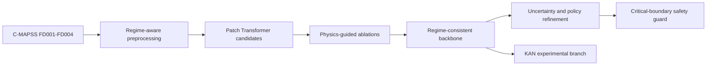
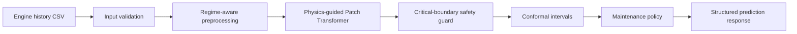
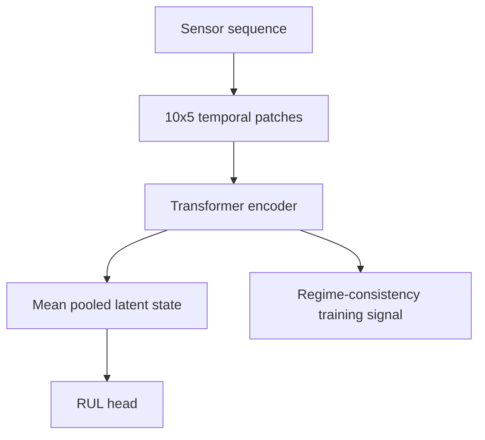
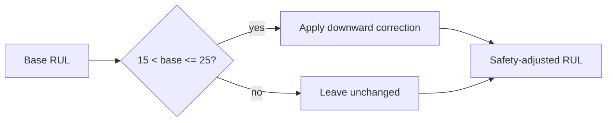
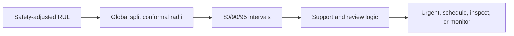
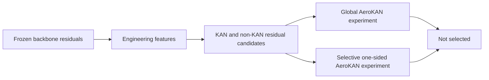
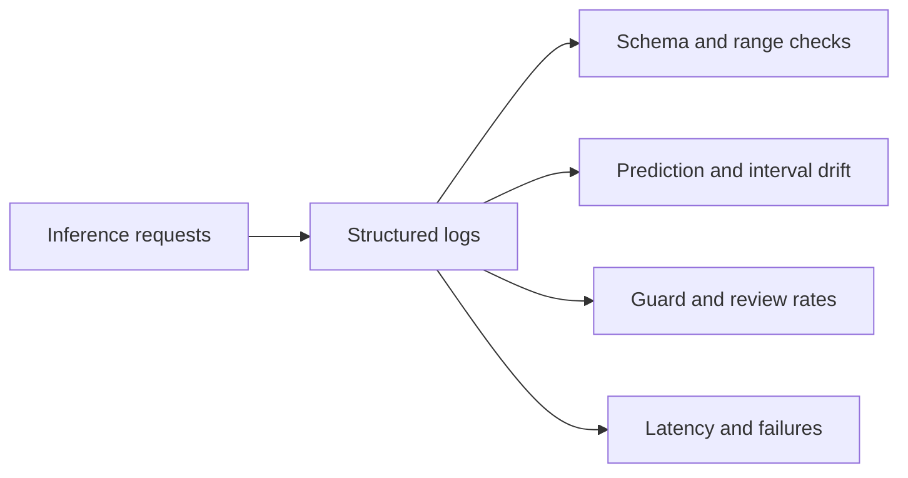

# Architecture

## Training Pipeline

## Frozen Production Inference Pipeline

## Physics-Guided Transformer

## Safety Guard

## Uncertainty And Maintenance Flow

## Experimental KAN Branch

## Monitoring Architecture

Selected production path: preprocessing, Regime-Consistent Physics-Guided Patch Transformer, deterministic guard, conformal intervals, and maintenance policy.

Experimental paths: global and selective AeroKAN residual correction branches.
